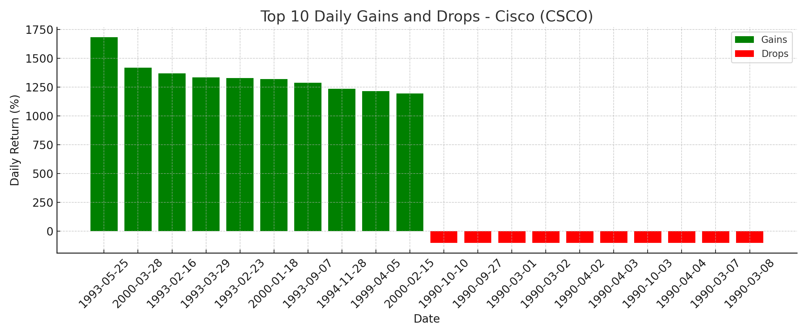

# Cisco Stock SQL Case Study

## Overview
This SQL project analyzes historical stock data for Cisco Systems Inc. (CSCO) to extract insights on performance, volatility, and trading activity. It was built using a SQLite database, real-world financial data, and SQL queries.

---

##  Dataset
- **File:** `CSCO.csv`
- **Columns:**
  - `Date`
  - `Open`, `High`, `Low`, `Close`, `Adjusted Close`
  - `Volume`
- **Frequency:** Daily stock prices

---

## Tools Used
- **DB Browser for SQLite** – for database setup and SQL queries
- **VS Code** – documentation and version control
- **Git & GitHub** – project hosting
- **Excel / Google Sheets** – optional for visualizations

---

## Data Preparation
- Imported `CSCO.csv` into SQLite as the `stock_data` table
- Removed rows with `NULL` in the `Close` column
- Verified formatting and data integrity

---

## SQL Analysis & Insights

### 1. Daily Return %
```sql
SELECT 
    Date,
    Close,
    LAG(Close) OVER (ORDER BY Date) AS Prev_Close,
    ROUND(((Close - LAG(Close) OVER (ORDER BY Date)) / LAG(Close) OVER (ORDER BY Date)) * 100, 2) AS Daily_Return_Pct
FROM stock_data;
```
Exported as: [daily_returns.csv](daily_returns.csv)

###  2. Top 10 Daily Gains
```sql
WITH returns AS (
  SELECT 
    Date,
    ((Close - LAG(Close) OVER (ORDER BY Date)) / LAG(Close) OVER (ORDER BY Date)) * 100 AS Daily_Return_Pct
  FROM stock_data
)
SELECT 
  Date,
  ROUND(Daily_Return_Pct, 2) AS Daily_Return_Pct
FROM returns
WHERE Daily_Return_Pct IS NOT NULL
ORDER BY Daily_Return_Pct DESC
LIMIT 10;
```
Exported as: [top_gains.csv](top_gains.csv)

### 3. Top 10 Daily Drops
```sql
WITH returns AS (
  SELECT 
    Date,
    ((Close - LAG(Close) OVER (ORDER BY Date)) / LAG(Close) OVER (ORDER BY Date)) * 100 AS Daily_Return_Pct
  FROM stock_data
)
SELECT 
  Date,
  ROUND(Daily_Return_Pct, 2) AS Daily_Return_Pct
FROM returns
WHERE Daily_Return_Pct IS NOT NULL
ORDER BY Daily_Return_Pct ASC
LIMIT 10;
```
Exported as: [top_drops.csv](top_drops.csv)

### 4. Monthly Average Close
```sql
SELECT 
    SUBSTR(Date, 7, 4) || '-' || SUBSTR(Date, 4, 2) AS Month,
    ROUND(AVG(Close), 2) AS Avg_Monthly_Close
FROM stock_data
GROUP BY Month
ORDER BY Month;
```
Exported as: [daily_returns.csv](daily_returns.csv)

### 5. Monthly Volatility
```sql
WITH returns AS (
  SELECT 
    SUBSTR(Date, 7, 4) || '-' || SUBSTR(Date, 4, 2) AS Month,
    ((Close - LAG(Close) OVER (ORDER BY Date)) / LAG(Close) OVER (ORDER BY Date)) * 100 AS Daily_Return_Pct
  FROM stock_data
),
avg_returns AS (
  SELECT 
    Month,
    AVG(Daily_Return_Pct) AS Avg_Pct
  FROM returns
  WHERE Daily_Return_Pct IS NOT NULL
  GROUP BY Month
)
SELECT 
  r.Month,
  ROUND(SQRT(AVG((r.Daily_Return_Pct - a.Avg_Pct) * (r.Daily_Return_Pct - a.Avg_Pct))), 2) AS Monthly_Volatility
FROM returns r
JOIN avg_returns a ON r.Month = a.Month
WHERE r.Daily_Return_Pct IS NOT NULL
GROUP BY r.Month
ORDER BY r.Month;
```
Exported as: [monthly_volatility.csv](monthly_volatility.csv)

### 6. Top 10 Volume Spikes
```sql
SELECT 
  Date,
  Volume
FROM stock_data
ORDER BY Volume DESC
LIMIT 10;
```
Exported as: [volume_spikes.csv](volume_spikes.csv)

##  Summary of Findings

- **Biggest Gain:** +1683.34% on 25-05-1993  
- **Biggest Drop:** -99.88% on 10-10-1990  
- **Most Volatile Month:** 2000-04 with 437.73%  
- **Highest Volume Day:** 16-02-1990 with 940,636,800 shares

> This is all Based on historical CSCO stock data

# Visualizations

### Monthly Average Close Price


### Top 10 Daily Gains and Drops


### Monthly Volatility of Daily Returns

